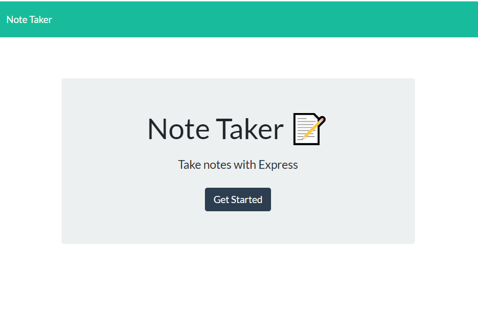
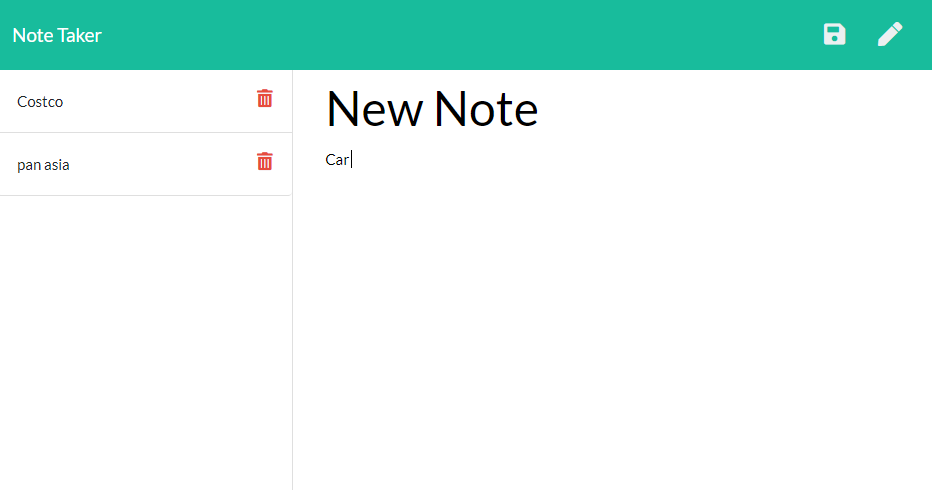

# Express-Note-Taker

Heroku URL : https://stormy-savannah-54658.herokuapp.com/
Github Repo: https://github.com/RaihanAkter03/Express-Note-Taker

## Description

* Application have two html file named index.html and notes.html & server.js. one db.json  file to return all saved notes as JSON .One style.css and index.js file.
    * GET  `/notes` return the `notes.html` file
    * GET `/` return the `index.html` file
* The application should have a `db.json` file on the backend used to store and retrieve notes using the `fs` module.
* GET `/api/notes` read the `db.json` file and return all saved notes as JSON.
* POST `/api/notes` receive a new note to save on the request body, add it to the `db.json` file, and then return the new note to the client.
* DELETE `/api/notes/:id` receive a query parameter containing the id of a note to delete. Each note have a unique `id` when it's saved. In order to delete a note, you'll need to read all notes from the `db.json` file, remove the note with the given `id` property, and then rewrite the notes to the `db.json` file.

## Deploying the App

* server.js file have used to connect backed and frontend. 
* We have to install npm express dependencies by using npm install express.
*  .gitignore file, add node_modules to not tracking node_modules files.
* var PORT = process.env.PORT || 3001; This allows to get the port from the bound environment variable (using `process.env.PORT`) if it exists, so that when your app starts on heroku's machine it will start listening on the appropriate port.
* This app deployed on Heroku.Here is heroku login url [Heroku Guide](https://id.heroku.com/login)
* Run the command `git push heroku main` to push any changes to the heroku. 

## User Story

AS A user, I want to be able to write and save notes

I WANT to be able to delete notes I've written before

SO THAT I can organize my thoughts and keep track of tasks I need to complete

## Business Context

For users that need to keep track of a lot of information, it's easy to forget or be unable to recall something important. Being able to take persistent notes allows users to have written information available when needed.